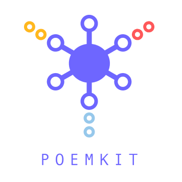
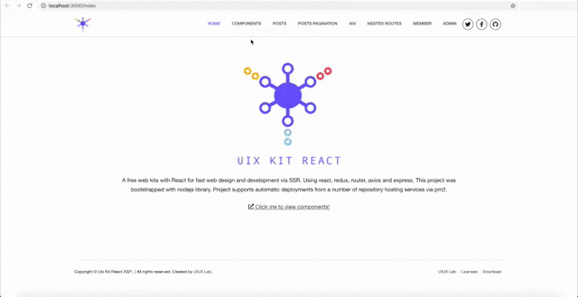

# PoemKit


<p align="center">
  <a href="https://github.com/xizon/poemkit">
	  
  </a>
  <p align="center">
      <a href="https://app.travis-ci.com/github/xizon/poemkit" title="Travis CI"></a>
	  <a href="https://www.npmjs.com/package/poemkit" title="npm version"></a>
	  <a href="https://github.com/xizon/poemkit/blob/master/LICENSE" title="license"></a>
	   
  </p>
  <br>
</p>


PoemKit系一套免费的网站开发工具包，它也是一个微前端架构。帮助开发者从零建立一个支持服务端渲染(SSR)的React技术网站，它支持pm2自动部署到服务器。PoemKit提供了 **50+** 个内置UI组件，用于构建现代Web应用程序。

**PoemKit可以直接通过命令工作和部署到云服务器, 但仍然需要在其背后编写真正的代码。** 这些工具包作为UI组件和逻辑模块，可以组合成一个真正的应用程序原型。它仍然需要编程功能才能使它们在实际需求中工作。PoemKit满足完全可定制的webpack配置需求。

---

- [English Documentation](README.md)
- [中文版说明文档](README_CN.md)

---


## 演示



在线演示 [https://uiux.cc/poemkit](https://uiux.cc/poemkit)

服务器端运行 `http://localhost:3000`


## 目录


* [介绍](#介绍)
* [开发者基本操作](#开发者基本操作)
* [个性化配置](#个性化配置)
* [目录结构](#目录结构)
* [兼容性](#兼容性)
* [支持的开发环境](#支持的开发环境)
* [许可证](#许可证)


## 介绍


* 基础环境: TypeScript 4.x.x + Babel 7.x.x + Webpack 5.x.x
* 提供结构化布局对象、UI控件等多种预置UI组件
* 可访问的URL、SEO优化，以及使用React Helmet使您的站点对搜索引擎友好
* 集开发、调试、打包和部署为一体
* 它不是一个JavaScript框架
* 没有jQuery且不绑定任何工具库
* 支持服务器端渲染（SSR）
* 组件分离，可以导入任何第三方UI组件到项目 (比如Ant Design)
* 使用Sass/SCSS来设置React组件的样式
* 自动捆绑并生成独立的核心CSS和JS文件
* 支持通过pm2自动部署到服务器
* ✂️ 插件扩展: 默认组件演示导入了诸如Bootstrap4栅格系统, GSAP动画库, FontAwesome图标库, 3D引擎等常用的第三方插件，以便能够快速扩展您的网站 (可以按需配置需要导入的库或者插件)
* ✂️ 可配置脚手架: 独立打包dist文件（您可以自主修改`webpack.config.js`使用内存挂载）


* * *


## 开发者基本操作

1. 配置你电脑的Node.js环境，推荐`Node 14+`版本，测试环境为v14.16.0

2. 下载完资源后，进入到 `poemkit` 目录下，运行相关命令进行开发或者部署。

3. 当你需要配置脚手架和网站基础信息和结构的时候，可编辑 `package.json` 文件。

4. 项目文件会打包生成到 `./dist/*` 和 `./public/*.html`.


## 命令使用方法:

**Step 1.** 下载项目

```sh
$ sudo npm install poemkit
```

或者克隆项目: 

```sh
$ git clone git://github.com/xizon/poemkit.git
```


**Step 2.** 使用命令进入 `poemkit/` 目录, {your_directory}换成你的目录路径

```sh
$ cd /{your_directory}/poemkit
```


**Step 3.** 安装所需要的依赖项

```sh
$ sudo npm install
```

**Step 4.** 常用的命令:

调试应用程序, 它可以用来单独检查TypeScript类型的文件而不进行编译操作，便于提高开发效率，专注整体代码的编写。

```sh
$ npm run check
```

打包生成CSS，JS，HTML文件

```sh
$ npm run build
```

运行下面的命令进行本地测试和代码检查 (仅运行Express服务器）。 使用 `Ctrl + C` 退出终端

```sh
$ npm run dev
```


**Step 5.** 浏览器中访问以下网址，可快速调试：

```sh
http://localhost:3000
```

建议在调试之前将新代码重新编译打包。


**Step 6 (可选).** 用PM2启动Reactjs应用程序（仅在使用Node v13.9.0或更高版本时有效）。


6.1) 安装Node和NPM

```sh
$ curl -sL https://rpm.nodesource.com/setup_14.x | sudo bash -
$ sudo yum install nodejs
$ node --version  #v14.16.1
$ npm --version   #6.14.12
$ which node babel-node #check the location of node and babel-node
```


6.2) 全局安装PM2

```sh
$ sudo npm install pm2@latest -g
```


6.3) 全局安装Babel

```sh
$ sudo npm install -g babel-cli
$ sudo npm install -g @babel/core @babel/cli @babel/preset-env 
```

6.4) 全局安装TypeScript和ts-node

```sh
$ sudo npm install -g typescript ts-node
```

6.5) 使用PM2安装TypeScript依赖

```sh
$ sudo pm2 install typescript
```


6.6) PM2常用命令:

```sh
#先进入 `"poemkit/"` 目录 
$ cd /{your_directory}/poemkit


#用pm2运行应用
$ pm2 start ecosystem.config.js

#其它命令
$ pm2 restart ecosystem.config.js
$ pm2 stop ecosystem.config.js
$ pm2 delete ecosystem.config.js
$ pm2 list
$ pm2 logs
```


6.7) 使用域名访问您的React应用。

需要在Apache或Nginx的Web服务器上部署React App。请参考网络以获取有关设置代理的教程。


**Step 7 (可选).** 单元测试

```sh
$ npm run test
```

**Step 8 (可选).** 部署到服务器

```sh
$ npm run deploy
```

撤销现有部署:

```sh
$ npm run destroy
```


<blockquote>
<h3>💡 温馨提示:</h3>
 
**a) ERROR: npm update check failed.**

如果出现如上错误，表示nodejs的环境或权限问题，可以使用下面的命令解决，注意把{username}换成你自己的设备里的名字。

```sh
$ sudo chown -R $USER:$(id -gn $USER) /Users/{username}/.config
```

**b) ERROR: Node sass version 6.x.x is not compatible with ^ 4.x.x.**

如果出现如上错误,请修改node-sass的版本:

```sh
$ npm install node-sass@4.14.1
```

**c) 如果升级Node版本，请执行以下代码：**

```sh
$ sudo npm install
$ sudo npm rebuild node-sass
```
</blockquote>


## 个性化配置


### ⚙️ 环境变量:

要在您的 `webpack.config.js` 中分流开发和生产构建之间的过程，您可以使用环境变量。

如果要同时考虑OS X和Windows，可以使用第三方工具 [cross-env](https://www.npmjs.com/package/cross-env)

**Step 1.** 运行命令安装 cross-env

```sh
$ npm install --save-dev cross-env
```

**Step 2.** 接着在`package.json`文件中修改脚本，传递变量和重新组装脚本命令

```json
"scripts": {
	"dev": "cross-env NODE_ENV=development nodemon --require ignore-styles --exec ts-node -r tsconfig-paths/register ./src/server/server.js",
    "build": "cross-env NODE_ENV=production webpack --progress --mode production"
}
```

通过跨环境设置变量和值 `NODE_ENV=xxx`, 然后我们在执行webpack时得到这个变量


**Step 3.** 进一步细化配置文件 `webpack.config.js`，以此检查从对象进程和属性env应用到变量 **NODE_ENV** 中：

```js
if (process.env.NODE_ENV === 'production') {
    // .. тwe apply (or add) some kind of plugin
}
```


### ⚙️ HTML模板:

修改默认的HTML模板 `./src/client/views/_html/index.html`， 它将自动生成为`./public/index.html`。 它脑包含了 [React Helmet](https://www.npmjs.com/package/react-helmet) 用于SEO的HTML标签，例如:

```html
<!DOCTYPE html>
<html {{helmetHtmlAttributes}}>
	<head>
		<meta charset="utf-8" />
		{{helmetTitle}}
		
		<!-- manifest.json provides metadata used when your web app is added to the
             homescreen on Android. See https://developers.google.com/web/fundamentals/engage-and-retain/web-app-manifest/
		============================================= -->
		<link rel="manifest" href="@@{website_root_directory}/manifest.json"/>
        
		<!-- Mobile Settings
		============================================= -->
        <meta name="viewport" content="width=device-width, initial-scale=1, maximum-scale=1"/>
        <!-- Mobile Settings end -->

		<!-- Compatibility
		============================================= -->
        <meta http-equiv="X-UA-Compatible" content="IE=edge"/>
        <!-- Compatibility  end -->
        
		<!-- Core & Theme CSS
		============================================= -->
        <link rel="stylesheet" href="@@{website_root_directory}/dist/css/poemkit.min.css?ver=@@{website_hash}"/>
        <!-- Core & Theme CSS  end -->

            
		<!-- SEO
		============================================= -->
		{{helmetMeta}}
		{{helmetLink}}
        <meta name="generator" content="@@{website_generator}"/>  
        <meta name="author" content="@@{website_author}"/> 
        <!-- SEO  end -->


		<!-- Favicons
		============================================= -->
		<link rel="icon" href="@@{website_root_directory}/assets/images/favicon/favicon-32x32.png" type="image/x-icon"/>
		<link rel="shortcut icon" href="@@{website_root_directory}/assets/images/favicon/favicon-32x32.png" sizes="32x32"/>
		<link rel="apple-touch-icon" href="@@{website_root_directory}/assets/images/favicon/apple-touch-icon-57x57.png"/>
		<link rel="apple-touch-icon" sizes="72x72" href="@@{website_root_directory}/assets/images/favicon/apple-touch-icon-72x72.png"/>
		<link rel="apple-touch-icon" sizes="114x114" href="@@{website_root_directory}/assets/images/favicon/apple-touch-icon-114x114.png"/>
		<!-- Favicons  end -->

  </head>  
  
  <body {{helmetBodyAttributes}}>

	  <noscript>
	      You need to enable JavaScript to run this app.
	  </noscript>
	  
	  <div id="app">{{reactApp}}</div>
	  
	<!-- Your Plugins & Theme Scripts
	============================================= -->
	<script>
		var REVISION     = "@@{website_version}",
			APP_ROOTPATH = {
				"templateUrl" : "@@{website_root_directory}", //If the file is in the root directory, you can leave it empty. If in another directory, you can write: "/blog"  (but no trailing slash)
				"homeUrl"     : "",  //Eg. https://uiux.cc
				"ajaxUrl"     : ""   //Eg. https://uiux.cc/wp-admin/admin-ajax.php
			};
    </script>  
    <script>window.__PRELOADED_STATE__ = {{preloadedState}};</script>
    <script src="@@{website_root_directory}/dist/js/poemkit.min.js?ver=@@{website_hash}"></script>
	<!-- Your Plugins & Theme Scripts  end -->
    
  </body>
</html>
```

配置文件 `./public/manifest.json`基于 `./src/config/tmpl-manifest.json` 自动生成。


### ⚙️ 配置模块和别名:

您可以通过修改 `webpack.config.js` 的 `resolve` 属性来创建 `import` 或 `require` 的别名，来确保模块引入变得更简单.

`webpack.config.js` :

```js
...
const alias = {
	pathConfig            : './src/config',
	pathComponents        : './src/client/components',
	pathRouter            : './src/client/router',
	pathHelpers            : './src/client/helpers',
	pathServices          : './src/client/services',
	pathReducers          : './src/client/reducers',
	pathPages             : './src/client/views/_pages',
	pathActions           : './src/client/actions',
	pathServer            : './src/server',
	pathStore             : './src/store'
};

...
resolve: {
	extensions: ['.js', '.es6', '.vue', '.jsx', '.ts', '.tsx' ],
	alias: {

		// 需要同时配置 `babel.config.js` 和 `tsconfig.json` 文件
		'@/config': path.resolve(__dirname, alias.pathConfig ),
		'@/components': path.resolve(__dirname, alias.pathComponents ),
		'@/router': path.resolve(__dirname, alias.pathRouter ),
		'@/helpers': path.resolve(__dirname, alias.pathHelpers ),
		'@/services': path.resolve(__dirname, alias.pathServices ),
		'@/reducers': path.resolve(__dirname, alias.pathReducers ),
		'@/pages': path.resolve(__dirname, alias.pathPages ),
		'@/actions': path.resolve(__dirname, alias.pathActions ),
		'@/server': path.resolve(__dirname, alias.pathServer ),
		'@/store': path.resolve(__dirname, alias.pathStore ),

	}
},
...
```

`babel.config.js` :

```js
...
  "plugins": [
	["module-resolver", {
	  "root": ["./src"],
	  "alias": {
		"@/config": "./src/config",
		"@/components": "./src/client/components",
		"@/router": "./src/client/router",
		"@/helpers": "./src/client/helpers",
		"@/services": "./src/client/services",
		"@/reducers": "./src/client/reducers",
		"@/pages": "./src/client/views/_pages",
		"@/actions": "./src/client/actions",
		"@/server": "./src/server",
		"@/store": "./src/store"
	  }
	}]
  ]
...
```


`tsconfig.json` :

```json
{
  "compilerOptions": {
    "baseUrl": "./src",
    "paths": {
        "@/config/*": ["config/*"],
        "@/components/*": ["client/components/*"],
        "@/router/*": ["client/router/*"],
        "@/helpers/*": ["client/helpers/*"],
        "@/services/*": ["client/services/*"],
        "@/reducers/*": ["client/reducers/*"],
        "@/pages/*": ["client/views/_pages/*"],
        "@/actions/*": ["client/actions/*"],
        "@/server/*": ["server/*"],
        "@/store/*": ["store/*"]
    }
  }
}
```

`package.json` :

```json
{
  "jest": {
    "testEnvironment": "jsdom",
    "moduleNameMapper": {
      "\\.(css|less|scss|sass)$": "identity-obj-proxy",
      "^@/config/(.*)": "<rootDir>/src/config/$1",
      "^@/components/(.*)": "<rootDir>/src/client/components/$1",
      "^@/router/(.*)": "<rootDir>/src/client/router/$1",
      "^@/helpers/(.*)": "<rootDir>/src/client/helpers/$1",
      "^@/services/(.*)": "<rootDir>/src/client/services/$1",
      "^@/reducers/(.*)": "<rootDir>/src/client/reducers/$1",
      "^@/pages/(.*)": "<rootDir>/src/client/views/_pages/$1",
      "^@/actions/(.*)": "<rootDir>/src/client/actions/$1",
      "^@/server/(.*)": "<rootDir>/src/server/$1",
      "^@/store/(.*)": "<rootDir>/src/store/$1"
    },
    "transform": {
      "^.+\\.(js|jsx)$": "babel-jest",
      "^.+\\.(ts|tsx)?$": "ts-jest"
    }
  }
}
```


### ⚙️ 库相关配置:

您可以通过修改 `webpack.config.js` 的 `output` 属性来指示 webpack 如何去输出、以及在哪里输出你的「bundle、asset 和其他你所打包或使用 webpack 载入的任何内容」


```js
...
const globs = {
	port                  : 8080,
	examples              : 'public',
	build                 : 'src/client',
	dist                  : 'dist'
};

...
output: {
	path: path.resolve(__dirname, './' + globs.dist + '/js' ),
	filename: '[name].js'
},
...
```


### ⚙️ 网站配置:

修改`package.json`文件即可：

```json
{
  "author": "UIUX Lab",
  "name": "poemkit",
  "email": "uiuxlab@gmail.com",
  "version": "1.0.0",
  "projectName": "PoemKit",
  "createdInfo": "UIUX Lab (https://uiux.cc)",
  "projectURL": "https://uiux.cc",
  "description": "React toolkit for building a full website that also is a Micro-Frontend Architecture",
  ...
}
```


### ⚙️ 路由配置:

路由配置同时也兼顾了网站的主导航（不包括将在主导航的页面上配置的嵌套路由）。 访问文件 `./src/client/router/RoutesConfig.js`. 


路由器的一些脚本可以在文件中修改 `./src/client/router/App.js`.


### ⚙️ 服务端渲染配置:

服务端渲染和标签替换的一些脚本可以在文件中修改 `./src/server/renderer.js`.


### ⚙️ 设置服务器代理:

为了同时运行服务器和React应用程序，我们需要在 `package.json` 中添加`proxy` 键。我们已经将服务器设置为在端口3000上运行，因此将代理指向 `localhost:3000`。

```json
{
  "proxy": "http://localhost:3000",
  ...
}
```

### ⚙️ 使用 `PropTypes` 检查类型:


```sh
$ npm run dev
```

使用下面的JavaScript脚本可以编写调试代码，在终端显示错误和警告信息。

```js
import PropTypes from "prop-types";
import React, { Component } from 'react';

export default class YourComponentName extends Component { 
	public static propTypes = {};
	constructor(props) {
		super(props);
	}
	render() { ... }
}

if ( process.env.NODE_ENV === 'development' ) {

	YourComponentName.propTypes = {
	    displayEnable: PropTypes.bool.isRequired,
		htmlString: PropTypes.oneOfType([PropTypes.string, PropTypes.object])
	}
	
}
```


### ⚙️ 自定义导入的第三方库或插件:

应用默认加载了常用的第三方库(图标，动画，3D引擎等)，您可以按需加载，或者修改导入配置。第三方插件配置文件位于 `./src/client/components/_plugins/`. 第三方插件默认和自定义组件一起使用，您也可以主动移除它们。


### ⚙️ 网站根目录配置:

更改网站的根目录，以便您的项目上传到另一个目录时可以使用它。修改 `./src/config/websiteConfig.js` 的键 `rootDirectory`。

如果该文件位于根目录中，则可以将其保留为空。 如果在另一个目录中，则可以写成 "/blog" **(结尾不要加斜杠)**


```json
{
  "rootDirectory": ""
}
```


### ⚙️ 网站URL配置:

网站地址(URL)通常被用于SEO优化。修改 `./src/config/websiteConfig.js` 的键 `siteUrl`。一个完整的URL一般被命名为 `https://domain-name.com` **(结尾不要加斜杠和子目录名称)**


```json
{
  "siteUrl": ""
}
```


### ⚙️ 接口API配置:

修改 `./src/config/websiteConfig.js` 的键 `API`, 如下代码:


```json
{
  "API": {
	  "RECEIVE_DEMO_LIST": "https://apiurl1.com",
	  "RECEIVE_DEMO_LISTDETAIL": "https://apiurl2.com"
  }
}
```


* * *


## 目录结构


```sh
poemkit/
├── README.md
├── CHANGELOG.md
├── CONTRIBUTING.md
├── LICENSE
├── ecosystem.config.js ------------------------- # 用于pm2部署
├── babel.config.js
├── webpack.config.js 
├── package-lock.json
├── package.json 
├── test/            --------------------------- # 单元测试脚本
├── public/          --------------------------- # 自动生成的首页HTML静态模板
│   ├── index.html 
│   ├── manifest.json
│   └── server/   ------------------------------- # 用于服务器测试的PHP脚本
│   └── assets/
├── dist/         ------------------------------- # web 编译出的文件，用于生产环境
│   ├── css/
│   │   ├── poemkit.css
│   │   └── poemkit.min.css
│   └── js/
│   │   ├── poemkit.js
│   │   └── poemkit.min.js
├── src/
│   ├── client/
│   │   ├── client.js
│   │   ├── actions/
│   │   ├── reducers/
│   │   ├── helpers/
│   │   ├── services/
│   │   ├── router/
│   │   ├── components/ -------------------------  # 独立的UI组件
│   │   │     ├── */
│   │   │     ├── _utils/ -----------------------  # 常用的实用程序和样式脚本
│   │   │     └── _plugins/ ---------------------  # 第三方插件
│   │   ├── views/ ------------------------------  # 网站页面
│   │   │     ├── _pages/
│   │   │     └── _html/
│   └── server/
│   │   ├── app.js
│   │   ├── server.js
│   │   └── renderer.js
│   └── store/
│   │   └── createStore.js
│   └── config/
│   │   ├── tmpl-manifest.json  ------------------  # 自动生成的 `manifest.json` 文件模板
│   │   └── websiteConfig.js  --------------------  # 网站配置文件(比如根目录)
└──
```


## 兼容性

| Chrome | Firefox | Edge | IE| Safari |Opera | iOS  | Android
| --- | --- | --- | --- | --- | --- | --- | --- |
| >= 49 | >= 45 | >=14 | >=11 | >= 9 | >= 30 | >=10 | >=4.4 |

## 支持的开发环境

- 支持React 17 +
- 支持ReactTypeScript 4.x.x + 
- 支持ReactBabel 7.x.x + 
- 支持ReactWebpack 5.x.x


## 许可证

基于 [MIT](https://opensource.org/licenses/MIT).


